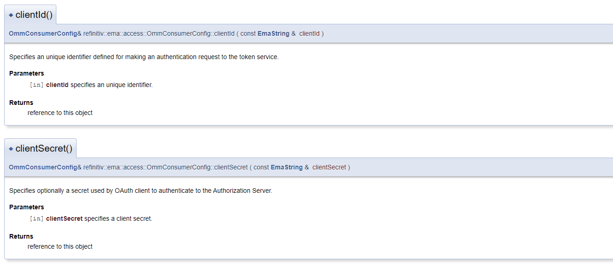
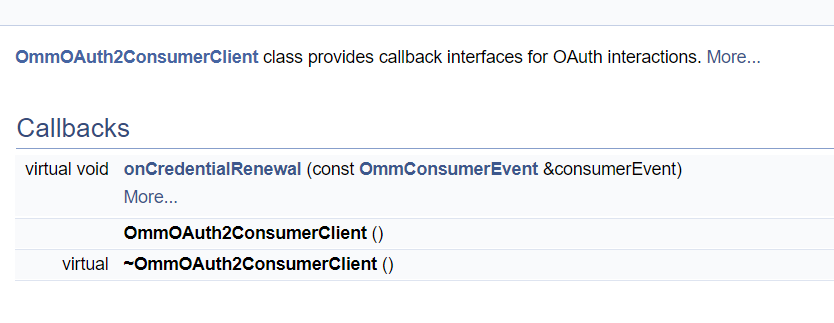
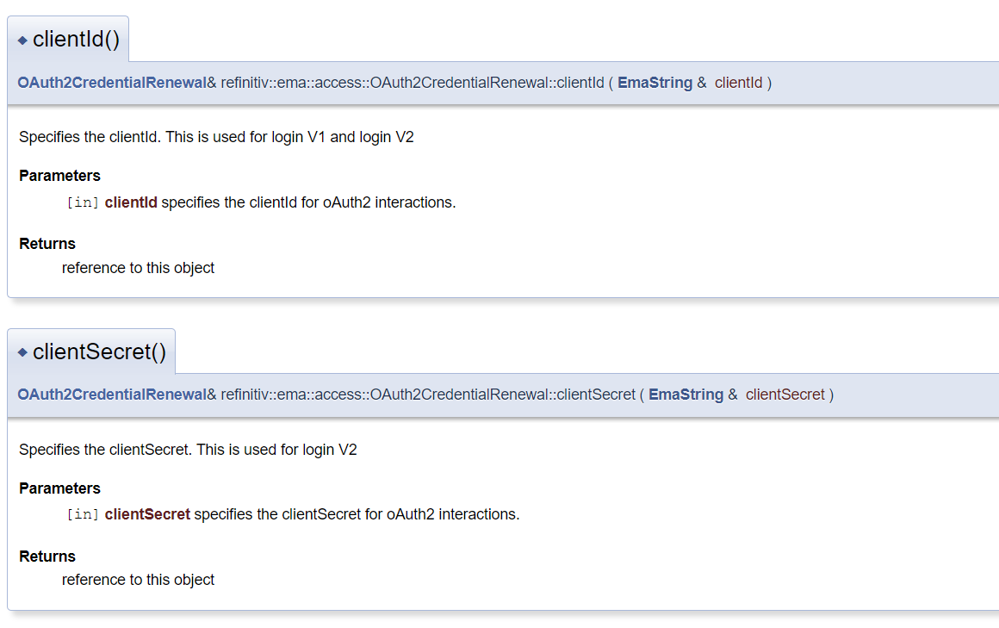
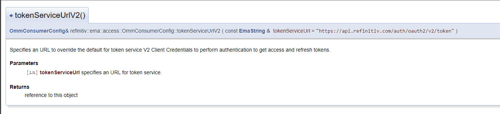
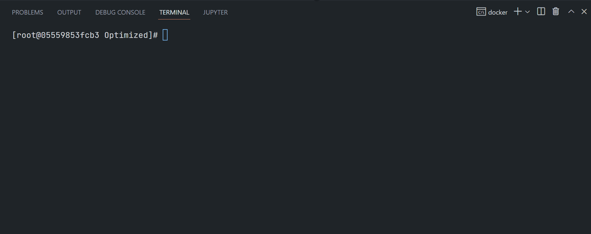
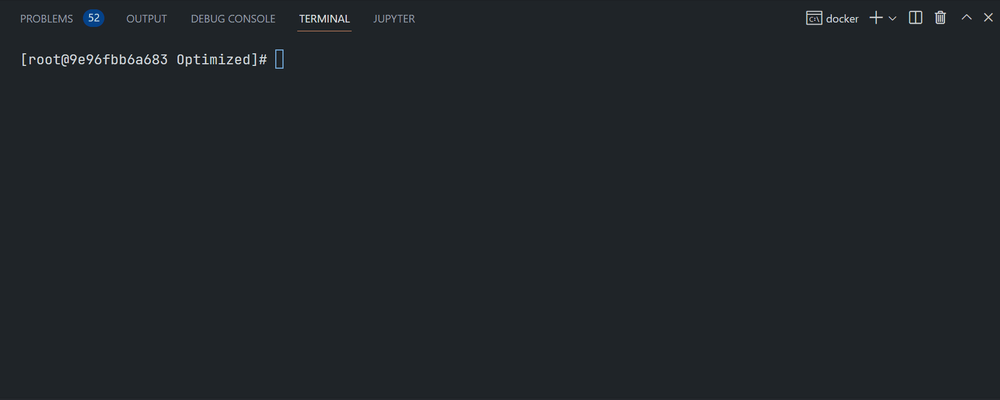

# Getting Started with Authentication V2 for Refinitiv Real-Time using Enterprise Message C++ API
- version: Draft
- Last update: Nov 2022

**Note**: This is a draft version of the public articles on the Developer Portal. For internal use documents, please check the [Article.RTO.AuthenticationV2.Internal](https://github.com/Refinitiv-API-Samples/Article.RTO.AuthenticationV2.Internal) repository. 

## <a id="intro"></a>Introduction

[Refinitiv Data Platform (RDP)](https://developers.refinitiv.com/en/api-catalog/refinitiv-data-platform/refinitiv-data-platform-apis) gives you seamless and holistic access to all of the Refinitiv content (whether real-time or non-real-time, analytics or alternative datasets), commingled with your content, enriching, integrating, and distributing the data through a single interface, delivered wherever you need it. As part of the Refinitiv Data Platform, the Refinitiv Real-Time - Optimized (RTO) gives you access to best-in-class Real-Time market data delivered in the cloud.  Refinitiv Real-Time - Optimized is a new delivery mechanism for RDP, using the AWS (Amazon Web Services) cloud.

The RTO utilizes the RDP authentication service to obtain Access Token information. The RDP authentication version 2 is a newly introduced authentication service for RTO. It is based on industry-standard [OAuth 2.0 - Client Credentials model](https://www.oauth.com/oauth2-servers/access-tokens/client-credentials/) with a lot of updates, changes, and benefits over version 1 for the RTO users. This document provides guidelines to migrate the EMA C++ consumer applications to use RDP authentication version 2. 

For more detail about the Authentication V2 overview and concept, please check this [Getting Started with Authentication V2](https://github.com/Refinitiv-API-Samples/Article.RTO.AuthenticationV2) document.

This article is based on RTSDK C++ version 2.0.7.L1 (EMA/ETA API version 3.6.7).

## <a id="v2_summary"></a>RDP Authentication Service version 2 Summaries

Let’s start with a summary of the RDP Authentication Service version 2. The RDP Authentication Service version 2 (or simply V2) is based on the [OAuth 2.0 - Client Credentials model](https://www.oauth.com/oauth2-servers/access-tokens/client-credentials/) model. The Authentication V2 simplifies the usage of access tokens. The V2 2 will only generate an access token, not both access and refresh tokens. 

Once connected to the Refinitiv Real-Time Optimized with an access token, there is no need to renew the access Token. The login session will remain valid until the application disconnects or is disconnected from RTO. The application/API will only re-request an Access Token in the following scenarios:
* When the consumer disconnects and goes into a reconnection state.
* If the Channel stays in reconnection long enough to get close to the expiry time of the Access Token.

### API Endpoint ###

API URL endpoint: **http://api.refinitiv.com/auth/oauth2/v2/token** (please be noticed the **v2** API version)

### Request Parameters

The authentication V2 does not use the **Password Grant/Refresh Grant** model, all connections (initial connection and re-new) use a ```grant_type``` of **client_credentials** to get access token information.

The authentication V2 requires the following access credential information in the HTTP request parameters:
- **grant_type**: The grant_type parameter must be set to **client_credentials**.
- **client_id**:  The ```client_id``` is a public identifier for apps.
- **client_secret**:  The ```client_secret``` is a secret known only to the application and the authorization server. It is essential to have the application’s password associated with the client ID.
- **scope (optional)**: Limits the scope of the generated token so that the Access token is valid only for a specific data set

**Note**: The ```V2 client_id``` **is not the same value** as the ```V1 client_id``` which is an ```app key``` of the [V1 - Password Grant Model](https://www.oauth.com/oauth2-servers/access-tokens/password-grant/).

That covers the overview of the RDP Authentication Service version 2.

## <a id="prerequisite"></a>Prerequisite
The Authentication V2 requires the following dependencies.
1. Authentication credential (*client_id* and *client_secret*).
2. RTSDK Developers: RTSDK version 2.0.5 (EMA/ETA API version 3.6.5) and above.
3. Internet connection.

Please contact your Refinitiv representative to help you to access the RTO account and services. 

## <a id="v2_ema_code"></a>RDP Authentication Version 2 EMA C++ Code Migration 

Moving on to the next topic, how to migrate the EMA C++ applications code to use the Authentication V2. The Refinitiv Real-Time SDK (RTSDK) [C/C++](https://developers.refinitiv.com/en/api-catalog/refinitiv-real-time-opnsrc/rt-sdk-cc) and [Java](https://developers.refinitiv.com/en/api-catalog/refinitiv-real-time-opnsrc/rt-sdk-java) editions already support the Authentication V2 since version **2.0.5** (EMA/ETA API version **3.6.5**). 

The EMA C++ API automatically operates the RTO HTTP and streaming connections workflow for the application. However, developers need to pass the V2 client_id and client_secret credentials to the API and use newly introduced Authentication V2 methods/interfaces for connecting to the RTO. The following parts in the code must be modified to migrate the EMA C++ applications to use RDP authentication version 2.

### 1. Setting RDP authentication version 2 credentials to the OmmConsumer Class

I will begin with the most important code migration, setting credentials to the ```OmmConsumer``` class. The RDP authentication version 2 oAuth Client Credentials requires a client ID and client secret credential instead of a username, password, and client ID. The client ID and client secret are set to the ```OmmConsumer``` instance via the ```OmmConsumerConfig``` class. 



The code must be modified to use the client ID and client secret, as shown below.

``` C++
AppClient client;
Map configDb;
OmmConsumerConfig config;

config.consumerName( "Consumer_1" ).clientId( clientId ).clientSecret( clientSecret ).config( configDb );

OmmConsumer consumer(config);
pOmmConsumer = &consumer;

consumer.registerClient( ReqMsg().serviceName( "ELEKTRON_DD" ).name( itemName ), client );
```
Note: The *userName*, *password*, and *V1 clientID* (*App Key*) properties are not used in RDP authentication version 2. 

### 2.  Setting RDP authentication version 2 credentials in the service discovery

If the application uses the service discovery, this modification is required. 

The service discovery is used to query service endpoints from the Refinitiv Real-Time Optimized service. It also requires RDP credentials to connect to the service discovery endpoint. To migrate to RDP authentication version 2, the client ID and client secret must be set in the ```ServiceEndpointDiscovery``` instance via the ```ServiceEndpointDiscoveryOption``` class. 

The code must be modified to use the client ID and client secret, as shown below.

``` C++
AppClient client;
ServiceEndpointDiscovery serviceDiscovery();

ServiceEndpointDiscoveryOption::TransportProtocol transportProtocol = ServiceEndpointDiscoveryOption::TcpEnum;
if (connectWebSocket)
{
	transportProtocol = ServiceEndpointDiscoveryOption::WebsocketEnum;
}

serviceDiscovery.registerClient( ServiceEndpointDiscoveryOption().clientId( clientId ).clientSecret( clientSecret )
    .transport( transportProtocol ).proxyHostName( proxyHostName ).proxyPort( proxyPort )
    .proxyUserName( proxyUserName ).proxyPassword( proxyPasswd ).proxyDomain( proxyDomain ), client );
```
Note: The *userName*, *password*, and *V1 clientID* (*App Key*) properties are not used in RDP authentication version 2.

### 3.  Setting a client secret in the ReactorOAuthCredentialRenewal
If the application uses the OAuth credential event callback function, this modification is required. 

By default, the Enterprise Message API will store all credential information. To use secure credential storage, a callback function can be specified by the user. If an ```OmmOAuth2ConsumerClient``` instance is specified when creating the OmmConsumer object, the EMA API does not store the password or clientSecret. In this case, the application must supply the password or clientSecret whenever the OAuth credential event ```OmmOAuth2ConsumerClient.onCredentialRenewal``` callback method is invoked. This call back must call set the credentials to the ```OAuth2CredentialRenewal``` instance and set it to```OmmConsumer.renewOAuthCredentials``` to provide the updated credentials.





``` C++
void OAuthClient::onCredentialRenewal( const OmmConsumerEvent& consumerEvent )
{
	/* In this function, an application would normally retrieve the user credentials(clientId and clientSecret) 
	   from a secure credential store.  For this example, the credentials will be stored as plain text.  This is
	   not secure, and is done for example purposes only */
	   
	OAuth2CredentialRenewal credentialRenewal;
	credentialRenewal.clientId("<client ID>");
	credentialRenewal.clientSecret("<client secret>");

	cout << "Renewal event called!" << endl;
	/* Call ommConsumer::renewOAuthCredentials to apply the credentials to the OmmConsumer object */
	pOmmConsumer->renewOAuth2Credentials(credentialRenewal);
}

AppClient client;
OAuthClient oAuthClient;
Map configDb;
OmmConsumerConfig config;

config.consumerName("Consumer_1").clientId(clientId).clientSecret(clientSecret).config(configDb);

OmmConsumer consumer( config, oAuthClient);
```
### 4.  Changing the RDP authentication version 2 endpoint
If the application changes the endpoint of the RDP authentication service, this modification is required.

By default, the endpoint of the RDP authentication version 2 is **https://api.refinitiv.com/auth/oauth2/v2/token**. However, this can be overridden by specifying another endpoint in the ```tokenServiceUrlV2``` method of the ```OmmConsumerConfig``` class. 



The RDP authentication version 2 endpoint can be changed via the following code.

``` C++
AppClient client;
Map configDb;
OmmConsumerConfig config;

config.consumerName( "Consumer_1" ).clientId( clientId ).clientSecret( clientSecret ).config( configDb );
config.tokenServiceUrlV2("<RDP Authentication V2 Endpoint>");

OmmConsumer consumer(config);
pOmmConsumer = &consumer;

consumer.registerClient( ReqMsg().serviceName( "ELEKTRON_DD" ).name( itemName ), client );
```
For more information, please refer to the ```Cons113```, ```Cons450```, and ```Cons451``` EMA examples in the Refinitiv Real-Time SDK C/C++ package. 

That covers the Authentication V2 code migration for the EMA C++ applications.

## <a id="v2_ema_run"></a>Running EMA C++ API Authentication V2 Examples

My next point is how to run the Authentication V2 examples. Developers can run the examples in a command line. Please check the RTSDK C/C++ readme file and the [API Compatibility Matrix](https://developers.refinitiv.com/en/api-catalog/refinitiv-real-time-opnsrc/rt-sdk-cc/documentation#api-compatibility-matrix) document for more detail about the supported OS and compiler versions.

Running *Cons451* Example:
``` Bash
$>Cons451 -clientId <ClientID> -clientSecret <ClientSecret> -p <14002/443> -h <RTO ADS Host> -itemName /THB=
```
Examples of RTO RSSL Hosts are as follows (based on each user's permission):
- ap-northeast-1-aws-3-sm.optimized-pricing-api.refinitiv.net
- us-east-1-aws-3-sm.optimized-pricing-api.refinitiv.net

 

Running *Cons450* Example:
``` Bash
$>Cons450 -clientId <ClientID> -clientSecret <ClientSecret> -itemName /THB=
```


Running *Cons113* Example:
``` Bash
$>Cons113 -clientId <ClientID> -clientSecret <ClientSecret> -itemName /THB=
```



## <a id="summary"></a>Summary
That brings me to the end of this article. The RDP Authentication version 2 simplifies the usage of access tokens when connecting to Refinitiv Real-Time Optimized. It uses the industry-standard [OAuth 2.0 - Client Credentials model] with a client ID, and client secret credentials instead of a username, password, and client ID (application key). The major advantage for real-time users is the applications don’t need to renew access tokens at every specific interval. The access token used by the application will remain valid until the application disconnects or is disconnected from Refinitiv Real-Time Optimized. 

To migrate applications to use the RDP authentication version 2, the code that relates to RDP Authentication must be modified including setting a client ID and client secret in ```OmmConsumerConfig```, ```ServiceEndpointDiscovery```, and ```OAuth2CredentialRenewal```, and optionally changing the RDP authentication version 2 endpoint in ```OmmConsumerConfig```. 

If you are using the other APIs in the Refinitiv Real-Time SDK family, please see more detail about using it with the Authentication V2 from the following resources:
- [Getting Started with Authentication V2 for Refinitiv Real-Time using Enterprise Message C++ API](./EMA_Cpp_Migration_V2.md) article
- [ETA C: Refinitiv Real-Time Optimized Authentication Version 2 Migration Guide](./ETA_C_Migration_V2.md) article
- [ETA Java: Refinitiv Real-Time Optimized Authentication Version 2 Migration Guide](./ETA_Java_Migration_V2.md) article

If you are the WebSocket API developer, even though you need to manually update the application source code to use new V2 HTTP and WebSocket connections, the V2 workflow is simple to operate when compared to the Authentication V1.  Please see more detail about using the WebSocket API with the Authentication V2 from the following resource:
- *Getting Started with Authentication V2 using WebSocket API* article (TBD)

That’s all I have to say about the EMA C++ and the Authentication V2 code migration.

## <a id="references"></a>References

For further details, please check out the following resources:
* [Getting Started with Authentication V2](https://github.com/Refinitiv-API-Samples/Article.RTO.AuthenticationV2) document.
* [Refinitiv Real-Time SDK Family](https://developers.refinitiv.com/en/use-cases-catalog/refinitiv-real-time) page.
* [Refinitiv Real-Time SDK C/C++ page](https://developers.refinitiv.com/en/api-catalog/refinitiv-real-time-opnsrc/rt-sdk-cc) on the [Refinitiv Developer Community](https://developers.refinitiv.com/) website.
* [Refinitiv Real-Time SDK Java page](https://developers.refinitiv.com/en/api-catalog/refinitiv-real-time-opnsrc/rt-sdk-java).
* [Refinitiv WebSocket API page](https://developers.refinitiv.com/en/api-catalog/refinitiv-real-time-opnsrc/refinitiv-websocket-api).
* [Getting Started with Authentication V2 for Refinitiv Real-Time using Enterprise Message C++ API article](./EMA_Cpp_Migration_V2.md)
* [ETA C: Refinitiv Real-Time Optimized Authentication Version 2 Migration Guide](./ETA_C_Migration_V2.md)
* [ETA Java: Refinitiv Real-Time Optimized Authentication Version 2 Migration Guide](./ETA_Java_Migration_V2.md)
* [OAuth 2.0 - Client Credentials](https://www.oauth.com/oauth2-servers/access-tokens/client-credentials/) page.
* [OAuth 2.0 - Access Token Response](https://www.oauth.com/oauth2-servers/access-tokens/access-token-response/) page.
* [OAuth 2.0 - Password Grant](https://www.oauth.com/oauth2-servers/access-tokens/password-grant/) page.
* [OAuth 2.0 - Client Credentials Grant](https://oauth.net/2/grant-types/client-credentials/) page.