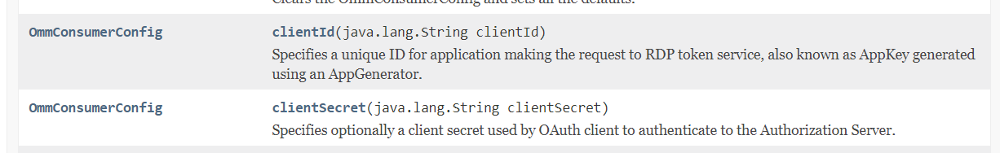
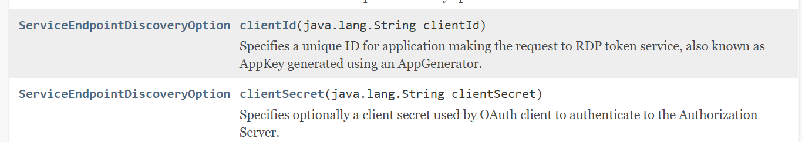
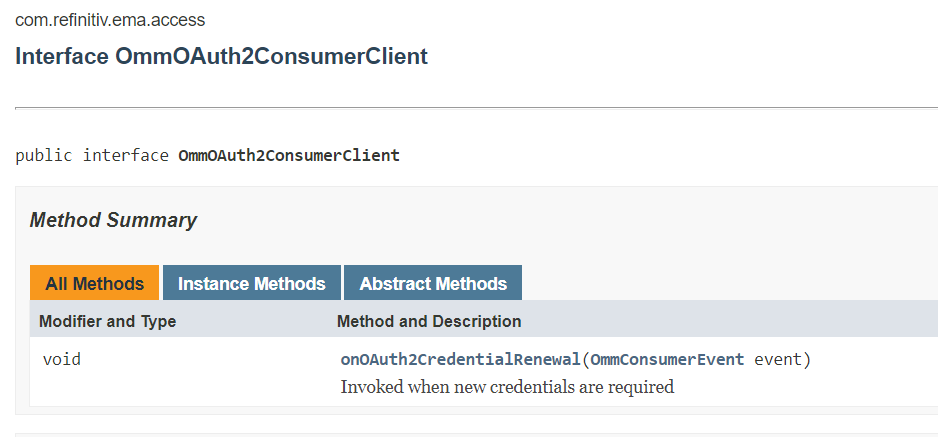
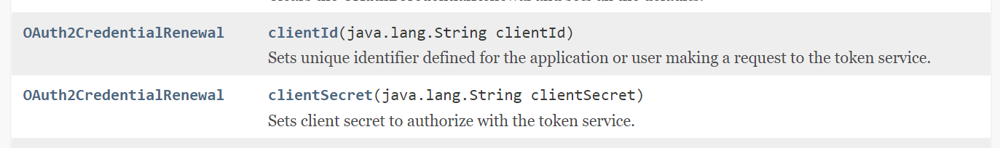
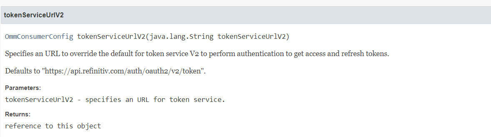
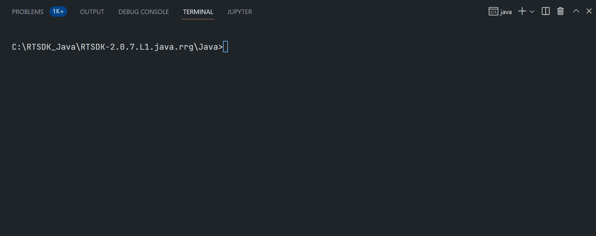
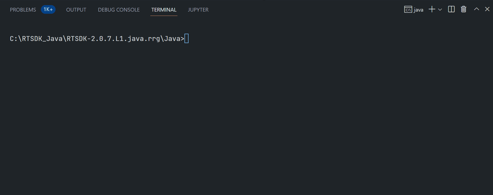
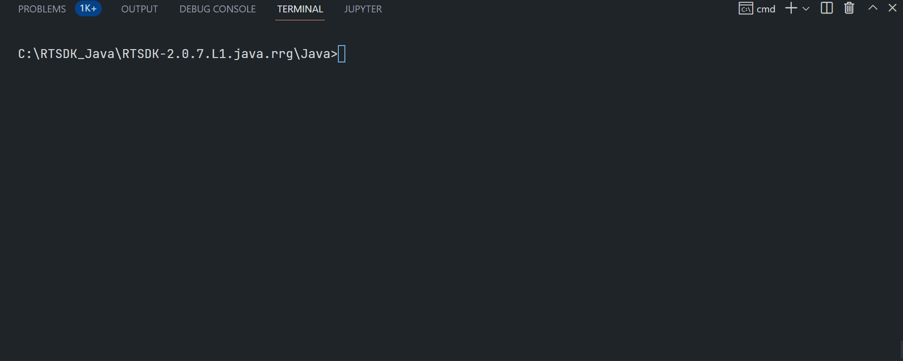

# EMA Java API: Real-Time Optimized Version 2 Authentication Migration Guide
- version: 1.5
- Last update: April 2025

## <a id="intro"></a>Introduction

**Last Updated**: June 2025

The [Delivery Platform APIs](https://developers.lseg.com/en/api-catalog/refinitiv-data-platform/refinitiv-data-platform-apis) (aka Data Platform, RDP) gives you seamless and holistic access to all of the LSEG content (whether real-time or non-real-time, analytics or alternative datasets), commingled with your content, enriching, integrating, and distributing the data through a single interface, delivered wherever you need it. As part of the Data Platform, the Real-Time - Optimized (RTO) gives you access to best-in-class Real-Time market data delivered in the cloud. The Real-Time - Optimized is a new delivery mechanism for RDP, using the AWS (Amazon Web Services) cloud.

The RTO utilizes the RDP authentication service to obtain Access Token information. The RDP's Version 2 Authentication is a newly introduced authentication service for RTO. It is based on the industry-standard [OAuth 2.0 - Client Credentials model](https://www.oauth.com/oauth2-servers/access-tokens/client-credentials/) and [Client Credentials with Private JWT Key](https://auth0.com/docs/secure/tokens/json-web-tokens) (*future release*) models with a lot of updates, changes, and benefits over Version 1 Authentication for the RTO users This document provides guidelines to migrate the EMA C++ consumer applications to use RDP Version 2 Authentication.

For more detail about the Version 2 Authentication overview and concept, please check this [Getting Started with Version 2 Authentication](https://github.com/LSEG-API-Samples/Article.RTO.AuthenticationV2) document and [article](https://developers.lseg.com/en/article-catalog/article/getting-started-with-version-2-authentication-for-refinitiv-real).

This article is based on RTSDK Java version 2.0.7.L1 (EMA/ETA API version 3.6.7).

## <a id="v2_summary"></a>RDP Authentication Service version 2 Summaries

Let’s start with a summary of the RDP's Version 2 Authentication Service (simply known as *V2 auth*, *oAuthClientCredentials* or *V2 Client Credentials*) service. It is based on the [OAuth 2.0 - Client Credentials Grant](https://www.oauth.com/oauth2-servers/access-tokens/client-credentials/) and [Client Credentials with Private JWT Key](https://auth0.com/docs/secure/tokens/json-web-tokens) (*future release*) models. The Version 2 Authentication - Client Credentials simplifies the usage of access tokens. The V2 auth will only generate an access token, not both access and refresh tokens. 

Once connected to the Real-Time Optimized with an access token, there is no need to renew the access Token. The login session will remain valid until the application disconnects or is disconnected from RTO. The application/API will only re-request an Access Token in the following scenarios:
* When the consumer disconnects and goes into a reconnection state.
* If the Channel stays in reconnection long enough to get close to the expiry time of the Access Token.

### API Endpoint ###

API URL endpoint: **http://api.refinitiv.com/auth/oauth2/v2/token** (please be noticed the **v2** API version)

### Request Parameters

There are 2 types of Version 2 Authentication, the *Client Credentials Grant* and *Private JWT*. 

#### Client Credentials Grant

The Version 2 Authentication - Client Credentials Grant model does not use the **Password Grant/Refresh Grant** model, all connections (initial connection and re-new) use a ```grant_type``` of **client_credentials** to get access token information.

The client must have the Service Credentials information for the Version 2 Authentication - Client Credentials Grant model which is the information in the HTTP request parameters:
- **grant_type**: The grant_type parameter must be set to **client_credentials**.
- **client_id**:  The ```client_id``` is a Service ID (public identifier for apps).
- **client_secret**:  The ```client_secret``` is a secret known only to the application and the authorization server (Password).
- **scope (optional)**: Limits the scope of the generated token so that the Access token is valid only for a specific data set

**Note**: The ```V2 client_id``` **is not the same value** as the ```V1 client_id``` which is an ```app key``` of the [V1 - Password Grant Model](https://www.oauth.com/oauth2-servers/access-tokens/password-grant/).

#### Client Credentials with Private JWT Key

The Private JWT uses a JSON object as a signed token (either a private secret or a public/private key). In this model instead of the client application using a client_id + client_secret in the Client Credentials Model grant model, the client application (and their Security team) create a JWT, sends the public key to us, and uses the JWT to sign the assertion for authentication to RDP. 

This Private JWT Key Model will be released in a future release. This article is focusing on the Client Credentials Grant model for now.

That covers the overview of the RDP Authentication Service version 2. This article is now focusing on the Client Credentials Grant model only.

## <a id="prerequisite"></a>Prerequisite
The Version 2 Authentication requires the following dependencies.
1. Authentication credential (*client_id* and *client_secret*).
2. RTSDK Developers: RTSDK version 2.0.5 (EMA/ETA API version 3.6.5) and above.
3. Internet connection.

Please contact your LSEG representative to help you to access the RTO account and services. 

## <a id="v2_ema_code"></a>RDP Version 2 Authentication EMA Java Code Migration 

Moving on to the next topic, how to migrate the EMA C++ applications code to use the Version 2 Authentication. The Real-Time SDK (RTSDK) [C/C++](https://developers.lseg.com/en/api-catalog/real-time-opnsrc/rt-sdk-cc), [Java](https://developers.lseg.com/en/api-catalog/real-time-opnsrc/rt-sdk-java) and [C#](https://developers.lseg.com/en/api-catalog/real-time-opnsrc/rt-sdk-csharp) editions already support the Version 2 Authentication since version **2.0.5** (EMA/ETA API version **3.6.5**). 

The EMA Java API automatically operates the RTO HTTP and streaming connections workflow for the application. However, developers need to pass the V2 client_id and client_secret credentials to the API and use newly introduced Version 2 Authentication methods/interfaces for connecting to the RTO. The following parts in the code must be modified to migrate the EMA Java applications to use RDP Version 2 Authentication.

### 1. Setting RDP Version 2 Authentication credentials to the OmmConsumer Class

I will begin with the most important code migration, setting credentials to the ```OmmConsumer``` class. The V2 auth Client Credentials requires a client ID and client secret credential instead of a username, password, and client ID. The client ID and client secret are set to the ```OmmConsumer``` instance via the ```OmmConsumerConfig``` class. 



The code must be modified to use the client ID and client secret, as shown below.

``` Java
OmmConsumer consumer = null;

AppClient appClient = new AppClient();
OmmConsumerConfig config = EmaFactory.createOmmConsumerConfig();

consumer = EmaFactory.createOmmConsumer(config.consumerName("Consumer_1").clientId(clientId).clientSecret(clientSecret));

consumer.registerClient(EmaFactory.createReqMsg().serviceName("ELEKTRON_DD").name(itemName), appClient);

```
Note: The *userName*, *password*, and *V1 clientID* (*App Key*) properties are not used in RDP Version 2 Authentication. 

### 2.  Setting RDP Version 2 Authentication credentials in the service discovery

If the application uses the service discovery, this modification is required. 

The service discovery is used to query service endpoints from the Real-Time Optimized service. It also requires RDP credentials to connect to the service discovery endpoint. To migrate to RDP Version 2 Authentication, the client ID and client secret must be set in the ```ServiceEndpointDiscovery``` instance via the ```ServiceEndpointDiscoveryOption``` class. 



The code must be modified to use the client ID and client secret, as shown below.

``` Java
AppClient appClient = new AppClient();

ServiceEndpointDiscovery serviceDiscovery = null;
serviceDiscovery = EmaFactory.createServiceEndpointDiscovery();

serviceDiscovery.registerClient(EmaFactory.createServiceEndpointDiscoveryOption().clientId(clientId).clientSecret(clientSecret)
    .transport(connectWebSocket ? ServiceEndpointDiscoveryOption.TransportProtocol.WEB_SOCKET : ServiceEndpointDiscoveryOption.TransportProtocol.TCP), appClient);
```
Note: The *userName*, *password*, and *V1 clientID* (*App Key*) properties are not used in RDP Version 2 Authentication. 

### 3.  Setting a client secret in the ReactorOAuthCredentialRenewal
If the application uses the OAuth credential event callback function, this modification is required. 

By default, the Enterprise Message API will store all credential information. To use secure credential storage, a callback function can be specified by the user. If an ```OmmOAuth2ConsumerClient``` instance is specified when creating the OmmConsumer object, the EMA API does not store the password or clientSecret. In this case, the application must supply the password or clientSecret whenever the OAuth credential event ```OmmOAuth2ConsumerClient.onCredentialRenewal``` callback method is invoked. This call back must call set the credentials to the ```OAuth2CredentialRenewal``` instance and set it to```OmmConsumer.renewOAuthCredentials``` to provide the updated credentials.





The code must be modified to use the client ID and client secret, as shown below.

``` Java
/* This is for example purposes, For best security, please use a proper credential store. */
class CredentialStore {
    public String clientSecret;
    public String clientId;
    public OmmConsumer consumer;
}

/* Implementation of OmmOAuth2ConsumerClient.  This is a very basic callback that uses the closure to obtain the OmmConsumer and call submitOAuthCredentialRenewal.
 * This is intended to show functionality, so this example does not implement or use secure credential storage.
 */
class OAuthCallback implements OmmOAuth2ConsumerClient {
    public void onOAuth2CredentialRenewal(OmmConsumerEvent event) {
        CredentialStore credentials = (CredentialStore)event.closure();
        
        OAuth2CredentialRenewal renewal = EmaFactory.createOAuth2CredentialRenewal();
        
        renewal.clientId(credentials.clientId);
        renewal.clientSecret(credentials.clientSecret);
        
        
        System.out.println("Submitting credentials due to token renewal");
        
        credentials.consumer.renewOAuthCredentials(renewal);
    }
}

// Consumer class
public class Consumer {

  static OAuthCallback oAuthCallback = new OAuthCallback();
  static CredentialStore credentials = new CredentialStore();

  OmmConsumer consumer = null;
  OmmConsumerConfig config = EmaFactory.createOmmConsumerConfig();

  credentials.clientId = "<client ID>";
  credentials.clientSecret = "<client secret>";
  
  consumer  = EmaFactory.createOmmConsumer(config.consumerName("Consumer_1")
    .clientSecret(credentials.clientSecret).clientId(credentials.clientId), oAuthCallback, (Object)credentials);

  credentials.consumer = consumer;
  
  consumer.registerClient(EmaFactory.createReqMsg().serviceName("ELEKTRON_DD").name(itemName), appClient);
}
```

### 4.  Changing the RDP Version 2 Authentication endpoint
If the application changes the endpoint of the RDP authentication service, this modification is required.

By default, the endpoint of the RDP Version 2 Authentication is **https://api.refinitiv.com/auth/oauth2/v2/token**. However, this can be overridden by specifying another endpoint in the ```tokenServiceUrlV2``` method of the ```OmmConsumerConfig``` class. 



The RDP Version 2 Authentication endpoint can be changed via the following code.

``` Java
OmmConsumer consumer = null;

AppClient appClient = new AppClient();
OmmConsumerConfig config = EmaFactory.createOmmConsumerConfig();

consumer = EmaFactory.createOmmConsumer(config.consumerName("Consumer_1")
    .clientId(clientId).clientSecret(clientSecret)
    .tokenServiceUrlV2("<RDP Version 2 Authentication Endpoint>"));

consumer.registerClient(EmaFactory.createReqMsg().serviceName("ELEKTRON_DD").name(itemName), appClient);

```
For more information, please refer to the ```ex113_MP_SessionMgmt```, ```ex450_MP_QueryServiceDiscovery```, and ```ex451_MP_OAuth2Callback_V2``` EMA examples in the Real-Time SDK Java package. 

That covers the Version 2 Authentication code migration for the EMA Java applications.

## <a id="v2_ema_run"></a>Running EMA Java API Version 2 Authentication Examples

My next point is how to run the Version 2 Authentication examples. Developers can run the examples in a command line with the [Gradle build tool](https://gradle.org/) and supported Java SDK. Please check the EMA Java readme file and the [API Compatibility Matrix](https://developers.lseg.com/en/api-catalog/refinitiv-real-time-opnsrc/rt-sdk-java/documentation#api-compatibility-matrix) document.

Running *ex451_MP_OAuth2Callback_V2* example:
``` Bash
$>gradlew.bat runconsumer451 --args="-clientId <ClientID> -clientSecret <ClientSecret> -p <14002/443> -h <RTO ADS Host> -itemName EUR="
```
Examples of RTO RSSL Hosts are as follows (based on each user's permission):
- ap-northeast-1-aws-3-sm.optimized-pricing-api.refinitiv.net
- us-east-1-aws-3-sm.optimized-pricing-api.refinitiv.net



Running *ex450_MP_QueryServiceDiscovery* example:
```Bash
$>gradlew.bat runconsumer450 --args="-clientId <ClientID> -clientSecret <ClientSecret> -itemName EUR="
```


Running *ex113_MP_SessionMgmt* example:
```Bash
$>gradlew.bat runconsumer113 --args="-clientId <ClientID> -clientSecret <ClientSecret> -itemName EUR="
```


## <a id="summary"></a>Summary
That brings me to the end of this article. The RDP Version 2 Authentication simplifies the usage of access tokens when connecting to Real-Time Optimized. It uses the industry-standard [OAuth 2.0 - Client Credentials model] with a client ID, and client secret credentials instead of a username, password, and client ID (application key). The major advantage for real-time users is the applications don’t need to renew access tokens at every specific interval. The access token used by the application will remain valid until the application disconnects or is disconnected from Real-Time Optimized. 

To migrate applications to use the RDP Version 2 Authentication, the code that relates to RDP Authentication must be modified including setting a client ID and client secret in ```OmmConsumerConfig```, ```ServiceEndpointDiscovery```, and ```OAuth2CredentialRenewal```, and optionally changing the RDP Version 2 Authentication endpoint in ```OmmConsumerConfig```. 

If you are using the other APIs in the Real-Time SDK family, please see more detail about using it with the Version 2 Authentication from the following resources:
- [EMA C++ API: Real-Time Optimized Version 2 Authentication Migration Guide](./EMA_Cpp_Migration_V2.md) article
- [ETA C: Real-Time Optimized Version 2 Authentication Migration Guide](./ETA_C_Migration_V2.md) article
- [ETA Java: Real-Time Optimized Version 2 Authentication Migration Guide](./ETA_Java_Migration_V2.md) article

If you are the WebSocket API developer, even though you need to manually update the application source code to use new V2 HTTP and WebSocket connections, the V2 workflow is simple to operate when compared to the Authentication V1.  Please see more detail about using the WebSocket API with the Version 2 Authentication from the following resource:
- [Real-Time WebSocket API: Real-Time Optimized Version 2 Authentication Migration Guide](WS_Migration_V2.md)

That’s all I have to say about the EMA Java and the Version 2 Authentication code migration.

## <a id="references"></a>References

For further details, please check out the following resources:

- [Changes to Customer Access and Identity Management: Real-Time - Optimized ](https://developers.lseg.com/en/article-catalog/article/changes-to-customer-access-and-identity-management--refinitiv-re) article
- [Getting Started with Version 2 Authentication](https://developers.lseg.com/en/article-catalog/article/getting-started-with-version-2-authentication-for-refinitiv-real)
- [Real-Time Market Data APIs & Distribution Family](https://developers.lseg.com/en/use-cases-catalog/real-time) page.
- [Real-Time SDK C/C++ page](https://developers.lseg.com/en/api-catalog/real-time-opnsrc/rt-sdk-cc).
- [Real-Time SDK C# page](https://developers.lseg.com/en/api-catalog/real-time-opnsrc/rt-sdk-csharp).
- [Real-Time SDK Java page](https://developers.lseg.com/en/api-catalog/real-time-opnsrc/rt-sdk-java).
- [WebSocket API page](https://developers.lseg.com/en/api-catalog/real-time-opnsrc/websocket-api).
- [ETA C: Real-Time Optimized Version 2 Authentication Migration Guide](https://developers.lseg.com/en/article-catalog/article/eta-c--refinitiv-real-time-optimized-authentication-version-2-mi) article.
- [ETA Java: Real-Time Optimized Version 2 Authentication Migration Guide](https://developers.lseg.com/en/article-catalog/article/eta-java--refinitiv-real-time-optimized-authentication-version-2) article.
- [EMA C++ API: Real-Time Optimized Version 2 Authentication Migration Guide](https://developers.lseg.com/en/article-catalog/article/ema-c-api-real-time-optimized-version-2-authentication-migration-guide) article.
- [EMA Java API: Real-Time Optimized Version 2 Authentication Migration Guide](https://developers.lseg.com/en/article-catalog/article/ema-java-api-real-time-optimized-version-2-authentication-migration-guide) article.
- [Real-Time WebSocket API: The Real-Time Optimized Version 2 Authentication Migration Guide](https://developers.lseg.com/en/article-catalog/article/webSocket-api-rto-v2-authentication-migration-guide) article.
- [OAuth 2.0 - Client Credentials](https://www.oauth.com/oauth2-servers/access-tokens/client-credentials/) page.
- [OAuth 2.0 - Access Token Response](https://www.oauth.com/oauth2-servers/access-tokens/access-token-response/) page.
- [OAuth 2.0 - Password Grant](https://www.oauth.com/oauth2-servers/access-tokens/password-grant/) page.
- [OAuth 2.0 - Client Credentials Grant](https://oauth.net/2/grant-types/client-credentials/) page.

For any questions related to this article or the RTSDK page, please use the Developer Community [Q&A Forum](https://community.developers.refinitiv.com/).