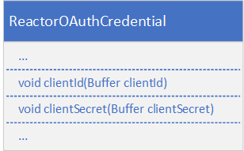
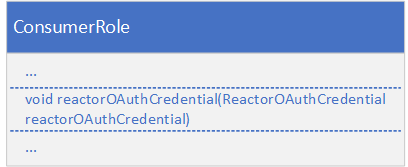
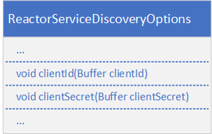
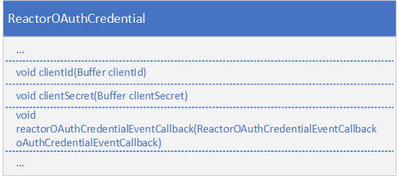
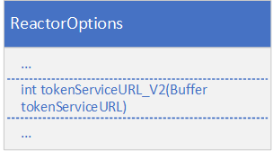

# ETA Java: Refinitiv Real-Time Optimized Authentication Version 2 Migration Guide

Real-Time Optimized (RTO) is Refinitiv conflated real-time content, hosted in the public cloud. It provides fast and simple access to our unparalleled content from hundreds of exchanges and OTC markets around the world.  

To connect to Refinitiv Real-Time Optimized, Refinitiv Real-Time applications need to send credentials to the authentication service on the Refinitiv Data Platform (RDP) to get an access token and a refresh token. An access token is a short live token used to log in to the Refinitiv Real-Time Optimized server while a refresh token is a long live token used to renew an access token. Therefore, the application needs to periodically use a refresh token to renew an access token and then use a new access token to re-login to the Refinitiv Real-Time Optimized server. Otherwise, the server will cut a connection when an access token expired. Moreover, a credential can’t be used simultaneously because a refresh token will be invalidated when the same credential is used by other applications. Then, the application with the invalid refresh token can’t renew an access token. 

Fortunately, the new RDP authentication version 2 simplifies the usage of access tokens. RDP authentication version 2 will only generate an access token, not both access and refresh tokens. Once connected to the Refinitiv Real-Time Optimized with an access token, there is no need to renew the access Token. The login session will remain valid until the application disconnects or is disconnected from RTO.

This article provides guidelines to migrate the ETA Java consumer applications to use RDP authentication version 2. RTSDK 2.0.5.L1 (ETA 3.6.5.L1) and above support RDP authentication version 2.

## RDP Authentication Version 2 Code Migration

ETA Java applications use the Enterprise Transport API reactor to connect to Refinitiv Real-Time Optimized. The Enterprise Transport API reactor is a connection management and event processing component that can significantly reduce the amount of code an application must write.  The following parts in the code must be modified to migrate the ETA Java applications to use RDP authentication version 2. 

### 1. Setting RDP authentication version 2 credentials in the OMM consumer role

RDP authentication version 2 oAuth Client Credentials requires a client ID and client secret instead of a username, password, and client ID. The client ID and client secret are set in the **ReactorOAuthCredential ** instance. 



The code must be modified to use the client ID and client secret, as shown below.

```
ReactorOAuthCredential oAuthCredential = ReactorFactory.createReactorOAuthCredential();

oAuthCredential.clientId().data("<client id>");

oAuthCredential.clientSecret().data("<client secret>");

```

Note: The *userName*, *password*, and *takeExclusiveSignOnControl* properties are not used in RDP authentication version 2. 

Then, the **ReactorOAuthCredential** is assigned to the *reactorOAuthCredential in the **ConsumerRole**.



### 2.	Setting RDP authentication version 2 credentials in the service discovery

If the application uses the service discovery, this modification is required. 

The service discovery is used to query service endpoints from the Refinitiv Real-Time Optimized service. It also requires RDP credentials to connect to the service discovery endpoint. To migrate to RDP authentication version 2, the client ID and client secret must be set in the **ReactorServiceDiscoveryOptions** instance. 



The code must be modified to use the client ID and client secret, as shown below.

```
ReactorServiceDiscoveryOptions reactorServiceDiscoveryOptions = ReactorFactory.createReactorServiceDiscoveryOptions();

reactorServiceDiscoveryOptions.clientId().data("<client id>");
reactorServiceDiscoveryOptions.clientSecret().data("<client secret>");	
...

```
Note: The *userName*, *password*, and *takeExclusiveSignOnControl* properties are not used in the RDP authentication version 2. 

Then, **ReactorServiceDiscoveryOptions** is passed to the **queryServiceDiscovery** method of the Reactor. 

```
if (reactor.queryServiceDiscovery(reactorServiceDiscoveryOptions, errorInfo) != ReactorReturnCodes.SUCCESS)
{
	System.out.println("Error: " + errorInfo.code() + " Text: " + errorInfo.error().text());
	return;
}
```

### 3.	Setting a client secret in the ReactorOAuthCredentialRenewal
If the application uses the OAuth credential event callback function, this modification is required. 

If *reactorOAuthCredentialEventCallback* is specified in the **ReactorOAuthCredential**, the Value Added Components Reactor does not store the password or clientSecret. In this case, the application must supply the password or clientSecret whenever the OAuth credential event callback function is invoked. 




In the callback function, the client secret is set in the **ReactorOAuthCredentialRenewal** instance and then is passed to the **submitOAuthCredentialRenewal** method of the Reactor. 

```
public int reactorOAuthCredentialEventCallback(ReactorOAuthCredentialEvent reactorOAuthCredentialEvent)
{
	ReactorOAuthCredentialRenewalOptions renewalOptions = ReactorFactory.createReactorOAuthCredentialRenewalOptions();
	ReactorOAuthCredentialRenewal oAuthCredentialRenewal = ReactorFactory.createReactorOAuthCredentialRenewal();	

	renewalOptions.renewalModes(ReactorOAuthCredentialRenewalOptions.RenewalModes.PASSWORD);

	oAuthCredentialRenewal.clientSecret().data("<client secret>");

	reactorOAuthCredentialEvent.reactor().submitOAuthCredentialRenewal(renewalOptions, oAuthCredentialRenewal, errorInfo);

		return ReactorCallbackReturnCodes.SUCCESS;
}
```

### 4.	Changing the RDP authentication version 2 endpoint
If the application changes the endpoint of the RDP authentication service, this modification is required.

By default, the endpoint of the RDP authentication version 2 is https://api.refinitiv.com/auth/oauth2/v2/token. However, this can be overridden by specifying another endpoint in the *tokenServiceURL_V2* property of the **ReactorOptions** instance. 



The RDP authentication version 2 endpoint can be changed via the following code.

```
ReactorOptions reactorOptions = ReactorFactory.createReactorOptions();

reactorOptions.tokenServiceURL_V2().data("<RDP Authentication V2 Endpoint>");

...

```
Then, the **ReactorOptions** is passed to the **ReactorFactory.createReactor** method.

```
Reactor reactor;
…
reactor = ReactorFactory.createReactor(reactorOptions, errorInfo);

```
For more information, please refer to the **com.refinitiv.eta.valueadd.examples.consumer**, and **com.refinitiv.eta.valueadd.examples.watchlistconsumer** examples in the Refinitiv Real-Time SDK Java package. 

## Summary
RDP Authentication version 2 simplifies the usage of access tokens when connecting to Refinitiv Real-Time Optimized. It uses a client ID, and client secret instead of a username, password, and client ID (application key). The applications don’t need to renew access tokens at every specific interval. The access token used by the application will remain valid until the application disconnects or is disconnected from Refinitiv Real-Time Optimized. To migrate applications to use RDP authentication version 2, the code that relates to RDP Authentication must be modified including setting a client ID and client secret in **ReactorOAuthCredential**, **ReactorServiceDiscoveryOptions**, and **ReactorOAuthCredentialRenewal**, and changing the RDP authentication version 2 endpoint in **ReactorOptions**. 
