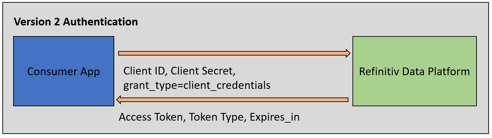
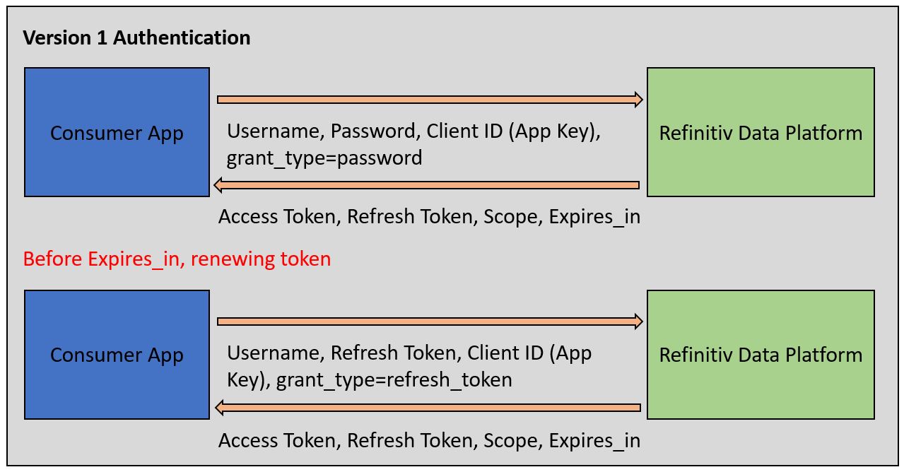
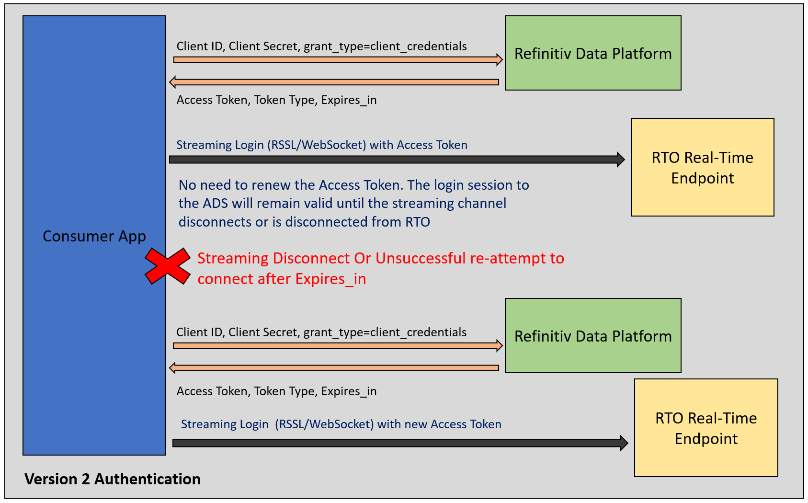
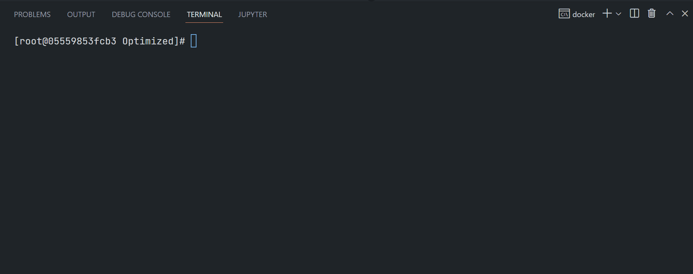
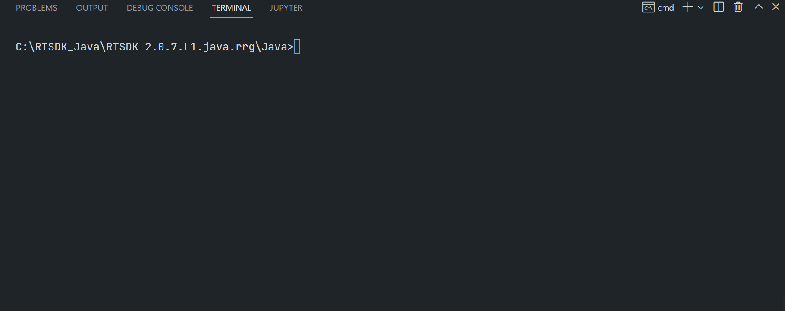
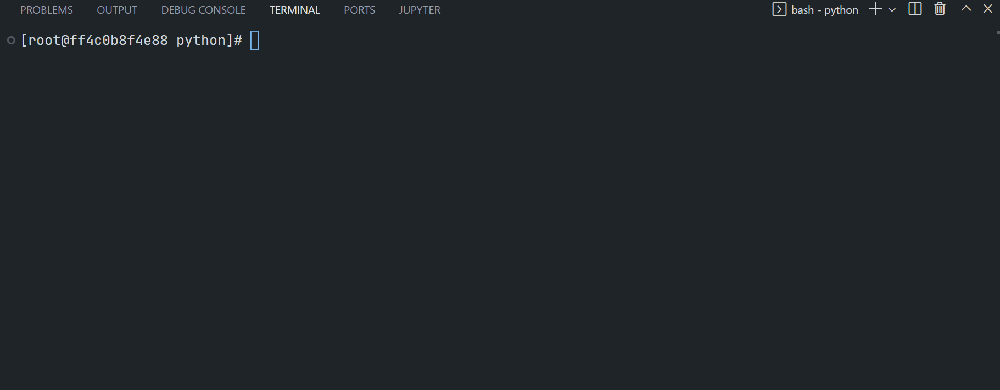
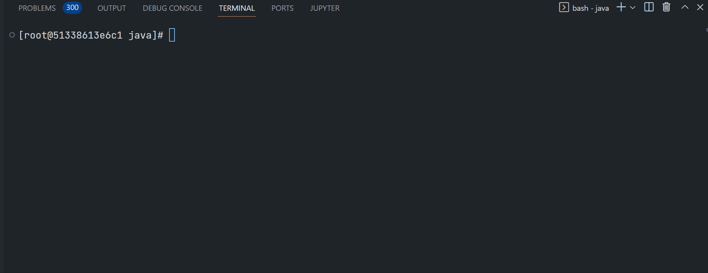
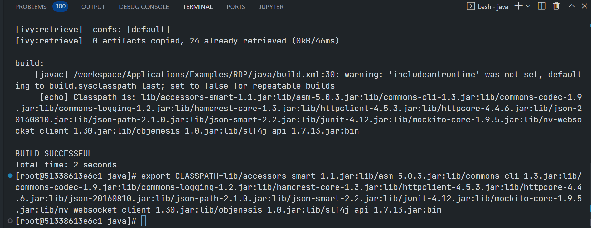

# Getting Started with Version 2 Authentication for Refinitiv Real-Time: Overview
- version: Draft
- Last update: November 2022

**Note**: This is a draft version of the public articles on the Developer Portal. For internal use documents, please check the [Article.RTO.AuthenticationV2.Internal](https://github.com/Refinitiv-API-Samples/Article.RTO.AuthenticationV2.Internal) repository. 

## <a id="intro"></a>Introduction

[Refinitiv Data Platform (RDP)](https://developers.refinitiv.com/en/api-catalog/refinitiv-data-platform/refinitiv-data-platform-apis) gives you seamless and holistic access to all of the Refinitiv content (whether real-time or non-real-time, analytics or alternative datasets), commingled with your content, enriching, integrating, and distributing the data through a single interface, delivered wherever you need it. As part of the Refinitiv Data Platform, the Refinitiv Real-Time - Optimized (RTO) gives you access to best-in-class Real-Time market data delivered in the cloud.  Refinitiv Real-Time - Optimized is a new delivery mechanism for RDP, using the AWS (Amazon Web Services) cloud.

The RTO utilizes the RDP authentication service to obtain Access Token information. The RDP's Version 2 Authentication is a newly introduced authentication service for RTO. It is based on industry-standard [OAuth 2.0 - Client Credentials model](https://www.oauth.com/oauth2-servers/access-tokens/client-credentials/) with a lot of updates, changes, and benefits over Version 1 Authentication for the RTO users. This document aims for helping developers to understand the Version 2 Authentication overview and workflow in general. 

This article is focusing on the Refinitiv Real-Time - Optimized developers (a machine-to-machine case) who need to migrate their applications to the V2 only.

## <a id="intro_rdp_auth"></a>Introduction to RDP Authentication Service

The first step of an application workflow is to get a token from RDP Authentication Service, which will allow access to the protected resource, i.e. data REST API, streaming services, etc. Once a valid token is received, this token is sent with every REST API call to get data. For the Real-Time Streaming service, this token must be sent when the application logins to the streaming server on the cloud.

Refinitiv Data Platform (RDP) entitlement check is based on OAuth 2.0 specification. The RDP's Version 1 Authentication service uses the [Password Grant](https://www.oauth.com/oauth2-servers/access-tokens/password-grant/) and [Refresh Token Grant](https://www.oauth.com/oauth2-servers/access-tokens/refreshing-access-tokens/) models to get the first set of tokens and renew subsequent tokens respectively. 

On the other hand, the RDP's Version 2 Authentication (or simply known as *V2 auth*, *oAuthClientCredentials* or *V2 Client Credentials*) service uses the oAuth2.0 [Client Credentials Grant](https://www.oauth.com/oauth2-servers/access-tokens/client-credentials/) model for getting token information. So, what the Client Credentials Grant Model is?

## <a id="intro_client_credential"></a>What is OAuth 2.0 - Client Credentials Grant Model?

The Client Credentials grant is used when applications request an access token to access their resources, not on behalf of a user.  This flow is the golden standard for machines-to-machines communication. The client credentials grant type allows an application to obtain an access token for resources owned by the client or when authorization has been *“previously arranged with an authorization server.”* This grant type is appropriate for applications that need to access APIs, such as storage services or databases, on behalf of themselves rather than on behalf of a specific user. 

This model uses the ```client_id``` and ```client_secret``` as the client authentication information to authenticate clients for this request. The ```client_id``` is a public identifier for apps, and the ```client_secret``` is the application’s password. The request ```grant_type``` parameter must be set to **client_credentials**. Please find more detail about the Client ID and Secret from the [OAuth 2.0  - The Client ID and Secret](https://www.oauth.com/oauth2-servers/client-registration/client-id-secret/) page.

Example HTTP request message from the [oauth.com](https://www.oauth.com/) website:
``` HTTP
POST /token HTTP/1.1
Host: authorization-server.com
 
grant_type=client_credentials
&client_id=xxxxxxxxxx
&client_secret=xxxxxxxxxx
```
**Note**: The ```Client Credentials  client_id``` **is not the same value** as the ```Password/Refresh Grants client_id``` which is an ```app key```.

If the request for an access token is valid, the authorization server needs to generate an access token and return these to the client, typically along with some additional properties about the authorization.

Example HTTP response message from the [oauth.com](https://www.oauth.com/) website:
``` HTTP
HTTP/1.1 200 OK
Content-Type: application/json
Cache-Control: no-store
 
{
  "access_token":"YYYYYYYYYYYYY",
  "token_type":"Bearer",
  "expires_in":7199
}
```
That’s all I have to say about the basics of the Client Credentials Model grant model. My next point is the difference between V1 and V2, and what are V2 benefits over V1.

## <a id="v1_v2_summary"></a>Authentication V1 and V2 Differences Summary

1. The API URL (**v1** and **v2**)
2. Credential. The V1 uses Machine Account (username, password, and App-Key), but the V2 uses a Service account (Client ID and Client Secret).
3. Grant Type models (V1 - Password/Refresh Grant vs V2 - Client Credentials) and request parameters 
4. Token Response Messages between V1 and V2 are different
5. The V2 uses the same Client Credential grant request message for both the initial request and renewal of the access token.
6. V2 auth produces a single Access Token. 

## <a id="v2_benefits"></a>Version 2 Authentication Benefits Over Version 1
1. Longer Access Token expiration time (V1's 10 minutes vs V2's 120 minutes).
2. V2 auth produces a single Access Token, easy to manage.
3. Simplify an Access Token renewal process
4. The application/API does not need to renew an Access Token (HTTP/RSSL-WebSocket) as long as the streaming channel (WebSocket/RSSL) is active, even if that session time passes the expires_in period. The consumer application only need re-request an Access Token in the following scenarios:
    * When the consumer disconnects and goes into a reconnection state.
    * If the *streaming channel stays in reconnection* long enough to get close to the expiry time of the Access Token.
5. Version 2 Authentication is a highly scalable and resilient infrastructure to support an increased user base.
6. Version 2 Authentication uses standard technologies and protocols. 

That covers a brief introduction to Version 2 Authentication.

## <a id="v2_http_detail"></a>Version 2 Authentication HTTP Operation in Details 

Moving on to the technical detail of the Version 2 Authentication. It is part of the RDP HTTP Web-based API that provides authentication service for users and applications via the Request-Response RESTful web service delivery mechanism. In general, the V2 is based on the [OAuth 2.0 - Client Credentials](https://www.oauth.com/oauth2-servers/access-tokens/client-credentials/) model. The API endpoint, credentials, request parameters, and response messages are not compatible with Authentication V1.

The Version 2 Authentication HTTP workflow is like the following diagram.



### API URL

The Version 2 Authentication endpoint URL is **http://api.refinitiv.com/auth/oauth2/v2/token**. 

Please be noticed that the API version is **v2** (the Authentication V1 uses **v1**).

### HTTP Method

Version 2 Authentication supports the *HTTP POST* method.

### Content-Type

Version 2 Authentication supports the *application/x-www-form-urlencoded* HTTP Content-Type.

### Request Parameters and Credentials

The request parameters of V1 and V2 are different. The Version 2 Authentication requires a Service account consisting of client ID (*not the App Key*) and client Secret credential information for the request parameter.

When you log into the Refinitiv Data Platform (either initial connection or renewal), you must use a ```grant_type``` of **client_credentials** to get access token information.

The Version 2 Authentication requires the following access credential information in the HTTP request parameters:
- **grant_type**: The grant_type parameter must be set to **client_credentials**.
- **client_id**:  The ```client_id``` is a public identifier for apps.
- **client_secret**:  The ```client_secret``` is a secret known only to the application and the authorization server. It is essential to have the application’s password associated with the client ID.
- **scope (optional)**: Limits the scope of the generated token so that the Access token is valid only for a specific data set

**Note**: The ```V2 client_id``` **is not the same value** as the ```V1 client_id```. The ```V1 client_id``` is an ```app key``` of the [V1 - Password Grant Model](https://www.oauth.com/oauth2-servers/access-tokens/password-grant/).

Example:
``` HTTP
POST /auth/oauth2/v2/token HTTP/1.1
Accept: */*
Content-Type: application/x-www-form-urlencoded
Host: api.refinitiv.com:443
Content-Length: XXX

client_id=KKKKKKKKKKKKKKKKKK
&client_secret=BBBBBBBBBBBBBBBBBBBB
&grant_type=client_credentials
&scope=trapi
```

### Response Message

Once the authentication is successful, the function gets the RDP Auth service response message and keeps the following RDP token information in the variables.
- **access_token**: The token used to invoke REST data API calls as described above. The application must keep this credential for further RDP APIs requests.
- **expires_in**: Access token validity time in seconds.
- **token_type (required)**: The type of token this is, typically just the string “Bearer”.

Example:
``` JSON
{
  "expires_in": 7199,
  "token_type": "Bearer",
  "access_token": "YYYYYYYYYYYYY"
}
```
### Renew Access Token

The Version 2 Authentication does not use a refresh grant logic. If the application needs a refreshing token, the application can just re-send a new authentication request (with ```grant_type``` of **client_credentials** ) to the RDP endpoint.

### Comparing with the Version 1 Authentication

The Version 1 Authentication uses the Password Grant model request for requesting the initial token, then uses the Refresh Grant model request for renewing the access token. The Version 1 also produces multiple types of tokens for requesting data and the renewal process. It means the application and API need to manage different types of request messages in the same application.

The Version 1 workflow is shown below.



You see that the Version 1 HTTP operation workflow is more complex than the Version 2.

That’s all I have to say about the RDP Authentication Service Version 2 HTTP workflow.

## <a id="service_discovery"></a>Refinitiv Real-Time Service Discovery

That brings us to the next RDP service, the Service Discovery.

After you obtain an authentication token, depending on its authorization and scope, you can use it to retrieve content from the RDP and connect to the RTO Streaming server. To connect to the RTO Streaming server, one can either specify an endpoint (VIP) or discover the list of endpoints (VIP) using a Refinitiv Data Platform service called *Service Discovery*.

To retrieve VIPs, an application must call the URL **https://api.refinitiv.com/streaming/pricing/v1/** API endpoint with the access token from the RDP Authentication Service in the request message header. The Service Discovery supports both V1 and V2 access tokens with the same HTTP GET request message.

Example HTTP GET request message.

``` HTTP
GET /streaming/pricing/v1/ HTTP/1.1
Accept: */*

Authorization: Bearer <Access Token from either V1 or V2>
Host: api.refinitiv.com:443
```
The Service Discovery response message structure is the same.

## <a id="v2_streaming_detail"></a>Version 2 Authentication - Connecting to Real-Time Streaming

My next point is the Real-Time streaming connection workflow with the Version 2 Authentication. 

One major benefit of Version 2 Authentication over V1 is the application/API does not need to renew the access token as long as the streaming channel (either WebSocket or RSSL connection) is active. This makes the Real-Time connection workflow of Authentication V1 and V2 different besides the changes between the HTTP operations with RDP Authentication service V1 and V2.

The workflow summaries are as follows:

### Version 2 Authentication Streaming Workflow

1. Send an HTTP Post message with a Client Credentials Grant to RDP API Version 2 Authentication service and obtain an access token and session expiration interval for your application 
2. Send HTTP Get message to with access token RDP API Service Discovery and obtain a list of  Real Time in Cloud Streaming servers.
3. Connect to the desired RTO Streaming server.
4. Send a login message to the RTO Streaming server with an access token.
5. Send item request messages to the RTO Streaming server.
6. Handle asynchronous responses and status changes when they occur, including “pings” and connection failures.
7. Once connected to the RTO Streaming server, there is no need to renew the Access Token. The login session to the RTO Streaming Server will remain valid (even if the connection time passes the Access Token expiry period) until the consumer disconnects or is disconnected from the RTO Streaming server. The consumer application only need re-request an Access Token in the following scenarios:
    * When the consumer disconnects and goes into a reconnection state.
    * If the *streaming channel stays in reconnection* long enough to get close to the expiry time of the Access Token.
8. Re-authenticate with RDP API Version 2 Authentication service using a Client Credentials Grant.
9. Attempt re-connect/re-issue login request to RTO Streaming server endpoint with the access token from ```step 8``` 
10. If the streaming channel reconnection process (```step 9```) gets close to the expires_in time, back to ```step 8``` get a new token for reconnection use.

Summary: 
* As long as the streaming connection (either RSSL or WebSocket) is alive, the application API does not need to renew Access Token (both RDP HTTP and RSSL/WebSocket streaming).
* Every time the application is disconnected, an application must request a new token to reconnect. If the reconnect attempt fails, then the same token can be re-used until Expires_in to avoid asking for a new token if RTO is down.



If you are using the Refinitiv Real-Time SDK, the API automatically handles this token renewal process for you. However, the Version 2 Authentication streaming workflow is much simpler for WebSocket API developers because the application does not need to renew the access token as long as its streaming channel is active.

### Comparing with the Version 1 Authentication

Unlike the V2, the Version 1 Authentication needs to re-authentication the RDP Authentication Service version 1 (HTTP REST) before the token is expired. And then re-issue an OMM Login request message (RSSL/WebSocket) with a new access token to keep the streaming channel open.

That covers the Real-Time Streaming connection overview with the RDP Authentication Service version 2.

## <a id="prerequisite"></a>Prerequisite
The RTO Version 2 Authentication requires the following dependencies.
1. RTO Version 2 Authentication access credentials (*client_id* and *client_secret*).
2. RTSDK Developers: RTSDK version 2.0.5 (EMA/ETA API version 3.6.5) and above.
3. WebSocket API Developers: The latest version of the WebSocket API examples.
4. Internet connection.

Please contact your Refinitiv representative to help you to access the RTO account and services. 

## <a id="v2_rtsdk"></a>How to use Version 2 Authentication with Refinitiv Real-Time SDK

Now let me turn to using the Version 2 Authentication with the Refinitiv Real-Time SDK (RTSDK) developers. The RTSDK [C/C++](https://developers.refinitiv.com/en/api-catalog/refinitiv-real-time-opnsrc/rt-sdk-cc) and [Java](https://developers.refinitiv.com/en/api-catalog/refinitiv-real-time-opnsrc/rt-sdk-java) editions already support the Version 2 Authentication since version 2.0.5 (EMA/ETA API version 3.6.5). 

This article is based on RTSDK version 2.0.7.L1 (EMA/ETA API version 3.6.7).

### <a id="v2_ema"></a>EMA API

The Enterprise Message API (EMA API) supports Version 2 Authentication since the API version **3.6.5.0** (RTSDK version **2.0.5**). The demo and example code are available in the following EMA example applications:
* ```ex113_MP_SessionMgmt``` (both V1 and V2), ```ex450_MP_QueryServiceDiscovery``` (both V1 and V2), and ```ex451_MP_OAuth2Callback_V2``` (V2 only) examples of EMA Java API
* ```Cons113``` (both V1 and V2), ```Cons450``` (both V1 and V2), and  ```Cons451``` (V2 only) examples of EMA C/C++ API. 

The EMA API automatically operates the HTTP and streaming connections workflow for the application. However, developers need to pass the V2 client_id and client_secret credentials to the API, and use newly introduced Version 2 Authentication methods/interfaces for connecting to the RTO.

The rest of the code logic such as subscription logic, incoming message callbacks, etc is the same.

For more detail about using the Version 2 Authentication with the Enterprise Message API, please check the following documents:
* [Getting Started with Version 2 Authentication for Refinitiv Real-Time using Enterprise Message Java API](./EMA_Java_Migration_V2.md)
* [Getting Started with Version 2 Authentication for Refinitiv Real-Time using Enterprise Message C/C++ API](./EMA_Cpp_Migration_V2.md)

#### EMA API Version 2 Authentication - Quick Start

My next point is the EMA examples quick start. This article is demonstrating the ```ex450_MP_QueryServiceDiscovery``` (Java) and ```Cons450``` (C/C++) examples.

EMA Java ```ex450_MP_QueryServiceDiscovery```:
``` Bash
$>gradlew.bat runconsumer450 --args="-clientId <ClientID> -clientSecret <ClientSecret> -itemName <RIC name>"
```


EMA C/C++ ```Cons450```:
``` Bash
$>Cons450 -clientId <ClientID> -clientSecret <ClientSecret> -itemName <RIC name>
```



### <a id="v2_eta"></a>ETA API

Now, what about the Enterprise Transport API? The Enterprise Transport API (ETA API) ValueAdd supports Version 2 Authentication since the API version **3.6.5.0** (RTSDK version **2.0.5**). The demo and example code are available in the following ETA example applications:
* ```ValueAdd - Consumer``` (both V1 and V2) and ```ValueAdd - WatchlistConsumer``` (both V1 and V2) examples of ETA ValueAdd Java API.
* ```VaConsumer``` (both V1 and V2) and  ```WatchlistConsumer``` (both V1 and V2) examples of ETA ValueAdd C API.

ETA developers need to pass the V2 client_id and client_secret credentials to the API with newly introduced Version 2 Authentication methods/interfaces for connecting to the RTO.

The rest of the code logic such as subscription logic, incoming message callbacks, etc is the same.

For more detail about using the Version 2 Authentication with the Enterprise Transport API, please check the following ETA articles 
* [ETA C: Refinitiv Real-Time Optimized Version 2 Authentication Migration Guide](./ETA_C_Migration_V2.md)
* [ETA Java: Refinitiv Real-Time Optimized Version 2 Authentication Migration Guide](./ETA_Java_Migration_V2.md)

#### ETA API Version 2 Authentication - Quick Start

My next point is the ETA examples quick start. This article is demonstrating the ```ValueAdd WatchListConsumer``` for Java and C/C++ examples.

ETA ValueAdd Java ```ValueAdd Consumer```:
``` Bash
$>gradlew.bat runVAConsumer --args="-c <RTO ADS Host>:<14002/443> ELEKTRON_DD mp:EUR= -clientId <ClientID> -clientSecret <ClientSecret> -connectionType encrypted -sessionMgnt"
```
Examples of RTO RSSL Hosts are as follows (based on each user's permission):
- ap-northeast-1-aws-3-sm.optimized-pricing-api.refinitiv.net
- us-east-1-aws-3-sm.optimized-pricing-api.refinitiv.net



ETA ValueAdd C ```ValueAdd Consumer```:
``` Bash
$>VAConsumer -encryptedSocket <RTO ADS Host>:<14002/443> ELEKTRON_DD mp:/THB= -clientId <ClientID> -clientSecret <ClientSecret> -sessionMgnt
```
Examples of RTO RSSL Hosts are as follows (based on each user's permission):
- ap-northeast-1-aws-3-sm.optimized-pricing-api.refinitiv.net
- us-east-1-aws-3-sm.optimized-pricing-api.refinitiv.net


That covers the RTSDK quick start with the Version 2 Authentication.

## <a id="v2_ws"></a>How to use the WebSocket API with Version 2 Authentication

That brings us to the WebSocket API. The [Websocket API for Pricing Streaming and Real-Time Services](https://developers.refinitiv.com/en/api-catalog/refinitiv-real-time-opnsrc/refinitiv-websocket-api) (aka WebSocket API) supports the Version 2 Authentication workflow. However, the WebSocket API developers need to operate the Version 2 Authentication HTTP and streaming connections manually. The example code that demonstrates the Version 2 Authentication workflow are the ```*RDPGW_ClientCredAuth*``` examples as follows:
* ```market_price_rdpgw_client_cred_auth.py``` for Python.
* ```MarketPriceRdpGwClientCredAuthExample.cs``` for C#
* ```MarketPriceRdpGwClientCredAuth.java``` for Java
* ```market_price_rdpgw_client_cred_auth.go``` for Go lang.

Please note that the main Version 2 Authentication workflow's concept is the same for all technologies and programming languages. WebSocket API developers can check the main logic from the examples above, then apply it to their preferred technology.

The rest of the code logic such as subscription logic, incoming message callbacks, ping-pong messages, etc is the same.

For more detail about using Version 2 Authentication with the WebSocket API, please check the upcoming *Getting Started with Version 2 Authentication using WebSocket API* article (TBD).

#### WebSocket API Version 2 Authentication - Quick Start

So, now let’s look at the WebSocket API with Version 2 Authentication examples quick start. This article is demonstrating Python and Java examples.

Python ```market_price_rdpgw_client_cred_auth.py```:

Firstly, install the dependencies using the [Python pip tool](https://packaging.python.org/en/latest/tutorials/installing-packages/#use-pip-for-installing).

``` Bash
$>pip install requests websocket-client
```

Next, run the application in a command line.

``` Bash
$>python market_price_rdpgw_client_cred_auth.py --clientid <clientid> --clientsecret <clientsecret>
```


Java ```MarketPriceRdpGwClientCredAuth.java```:

Firstly, build and compile the project with [Apache Ant](https://ant.apache.org/).
``` Bash
$>ant
```
Next, set the Java Classpath that Ant gave you

``` Bash
$>export CLASSPATH=lib/accessors-smart-1.1.jar:lib/asm-5.0.3.jar:lib/commons-cli-1.3.jar:lib/commons-codec-1.9.jar:lib/commons-logging-1.2.jar:lib/hamcrest-core-1.3.jar:lib/httpclient-4.5.3.jar:lib/httpcore-4.4.6.jar:lib/json-20160810.jar:lib/json-path-2.1.0.jar:lib/json-smart-2.2.jar:lib/junit-4.12.jar:lib/mockito-core-1.9.5.jar:lib/nv-websocket-client-1.30.jar:lib/objenesis-1.0.jar:lib/slf4j-api-1.7.13.jar:bin
```



Then, run the example with the following command:

``` Bash
$>java MarketPriceRdpGwClientCredAuth --clientid <ClientID> --clientsecret <ClientSecret> --ric /EUR=
```



That’s all I have to say about the WebSocket API quick start with the Version 2 Authentication.

## <a id="conclusion"></a>Conclusion and Next Steps

That brings me to the end of this article. The RDP Authentication Service version 2 brings a lot of improvements to the Refinitiv Real-Time - Optimized (RTO) applications. The V2 simplifies the overall authentication process with a single access token and a long token expiration time. The major advantage for real-time users is the application/API does not need to renew the access token as long as the streaming connection is active.

If you are the Refinitiv Real-Time SDK developer, the API automatically handles the new workflow for you. You just need to update the application source code to use newly introduced Version 2 Authentication methods/interfaces for connecting to the RTO with the V2 client_id and client_secret credential. Please see more detail about using the RTSDK with the Version 2 Authentication from the following resources:
- [Getting Started with Version 2 Authentication for Refinitiv Real-Time using Enterprise Message Java API](./EMA_Java_Migration_V2.md) article
- [Getting Started with Version 2 Authentication for Refinitiv Real-Time using Enterprise Message C++ API](./EMA_Cpp_Migration_V2.md) article
- [ETA C: Refinitiv Real-Time Optimized Version 2 Authentication Migration Guide](./ETA_C_Migration_V2.md) article
- [ETA Java: Refinitiv Real-Time Optimized Version 2 Authentication Migration Guide](./ETA_Java_Migration_V2.md) article

If you are the WebSocket API developer, even though you need to manually update the application source code to use new V2 HTTP and WebSocket connections, the V2 workflow is simple to operate when compared to the Authentication V1.  Please see more detail about using the WebSocket API with the Version 2 Authentication from the following resource:
- *Getting Started with Version 2 Authentication using WebSocket API* article (TBD)

## <a id="references"></a>References

For further details, please check out the following resources:
* [Refinitiv Real-Time SDK Family](https://developers.refinitiv.com/en/use-cases-catalog/refinitiv-real-time) page.
* [Refinitiv Real-Time SDK C/C++ page](https://developers.refinitiv.com/en/api-catalog/refinitiv-real-time-opnsrc/rt-sdk-cc) on the [Refinitiv Developer Community](https://developers.refinitiv.com/) website.
* [Refinitiv Real-Time SDK Java page](https://developers.refinitiv.com/en/api-catalog/refinitiv-real-time-opnsrc/rt-sdk-java).
* [Refinitiv WebSocket API page](https://developers.refinitiv.com/en/api-catalog/refinitiv-real-time-opnsrc/refinitiv-websocket-api).
* [ETA C: Refinitiv Real-Time Optimized Version 2 Authentication Migration Guide](./ETA_C_Migration_V2.md)
* [ETA Java: Refinitiv Real-Time Optimized Version 2 Authentication Migration Guide](./ETA_Java_Migration_V2.md)
* [Getting Started with Version 2 Authentication for Refinitiv Real-Time using Enterprise Message Java API](./EMA_Java_Migration_V2.md)
* [Getting Started with Version 2 Authentication for Refinitiv Real-Time using Enterprise Message C++ API](./EMA_Cpp_Migration_V2.md)
* Getting Started with Version 2 Authentication using WebSocket API (TBD)
* [OAuth 2.0 - Client Credentials](https://www.oauth.com/oauth2-servers/access-tokens/client-credentials/) page.
* [OAuth 2.0 - Access Token Response](https://www.oauth.com/oauth2-servers/access-tokens/access-token-response/) page.
* [OAuth 2.0 - Password Grant](https://www.oauth.com/oauth2-servers/access-tokens/password-grant/) page.
* [OAuth 2.0 - Client Credentials Grant](https://oauth.net/2/grant-types/client-credentials/) page.